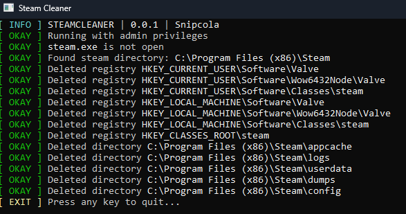

## 🧹 SteamCleaner

## 📋 Instructions:

**Note**: To get the executable, either view the [releases](https://code.snipcola.st/snipcola/SteamCleaner/releases) of this repository, or compile it yourself.

1. Ensure that your steam client is **closed**.
2. Run the executable **as administrator** and wait for it to complete.
3. The process should be complete, you may relaunch steam - although you will be logged out of your account(s) & it may reinstall or ask for repair.
